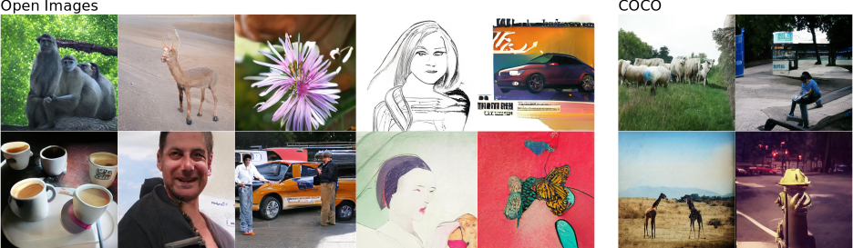

## Scene Image Synthesis

Scene image generation based on bounding box conditionals as done. Supporting the datasets COCO and Visual Genome Images.

### Training
Download first-stage models [COCO-8k-VQGAN](https://heibox.uni-heidelberg.de/f/78dea9589974474c97c1/) for COCO.
Change `ckpt_path` in `data/coco_scene_images_transformer.yaml` to point to the downloaded first-stage models.
Download the full COCO/OI datasets and adapt `data_path` in the same files, unless working with the 100 files provided for training and validation suits your needs already.

Code can be run with
`python main.py --base configs/coco_scene_images_transformer.yaml -t True --gpus 0,`

`python main.py --base configs/coco_pretrain_stage.yaml -t True --gpus 0,`

### Sampling 
Train a model as described above or download a pre-trained model:
 - [COCO 30 epochs](https://heibox.uni-heidelberg.de/f/0d0b2594e9074c7e9a33/)
 - [COCO 60 epochs](https://drive.google.com/file/d/1bInd49g2YulTJBjU32Awyt5qnzxxG5U9/) (find model statistics for both COCO versions in `assets/coco_scene_images_training.svg`)

When downloading a pre-trained model, remember to change `ckpt_path` in `configs/*project.yaml` to point to your downloaded first-stage model (see ->Training).

Scene image generation can be run with
`python scripts/make_scene_samples.py --outdir=/some/outdir -r /path/to/pretrained/model --resolution=512,512`


## Training on custom data

Training on your own dataset can be beneficial to get better tokens and hence better images for your domain.
Those are the steps to follow to make this work:
1. install the repo with `conda env create -f environment.yaml`, `conda activate taming` and `pip install -e .`
1. put your .jpg files in a folder `your_folder`
2. create 2 text files a `xx_train.txt` and `xx_test.txt` that point to the files in your training and test set respectively (for example `find $(pwd)/your_folder -name "*.jpg" > train.txt`)
3. adapt `configs/custom_vqgan.yaml` to point to these 2 files
4. run `python main.py --base configs/custom_vqgan.yaml -t True --gpus 0,1` to
   train on two GPUs. Use `--gpus 0,` (with a trailing comma) to train on a single GPU.

### COCO
Create a symlink `data/coco` containing the images from the 2017 split in
`train2017` and `val2017`, and their annotations in `annotations`. Files can be
obtained from the [COCO webpage](https://cocodataset.org/). In addition, we use
the [Stuff+thing PNG-style annotations on COCO 2017
trainval](http://calvin.inf.ed.ac.uk/wp-content/uploads/data/cocostuffdataset/stuffthingmaps_trainval2017.zip)
annotations from [COCO-Stuff](https://github.com/nightrome/cocostuff), which
should be placed under `data/cocostuffthings`.


#### COCO-stuff 2017 
##### Standard split (Layout2I & Label2I)
- We follow [TwFA](https://openaccess.thecvf.com/content/CVPR2022/papers/Yang_Modeling_Image_Composition_for_Complex_Scene_Generation_CVPR_2022_paper.pdf) and [LAMA](https://openaccess.thecvf.com/content/ICCV2021/papers/Li_Image_Synthesis_From_Layout_With_Locality-Aware_Mask_Adaption_ICCV_2021_paper.pdf) to perform layout-to-image experiment on COCO-stuff 2017, which can be downloaded from [official COCO website](https://cocodataset.org/#download).
- Please create a folder name `2017` and collect the downloaded data and annotations as follows.

   <details><summary>COCO-stuff 2017 split file structure</summary>

   ```
   >2017
   ├── annotations
   │   └── captions_val2017.json
   │   └── ...
   └── val2017
      └── 000000000872.jpg
      └── ... 
   ```

   </details>


#### Visual Genome (Layout2I & SG2I)
- We follow [TwFA](https://openaccess.thecvf.com/content/CVPR2022/papers/Yang_Modeling_Image_Composition_for_Complex_Scene_Generation_CVPR_2022_paper.pdf) and [LAMA](https://openaccess.thecvf.com/content/ICCV2021/papers/Li_Image_Synthesis_From_Layout_With_Locality-Aware_Mask_Adaption_ICCV_2021_paper.pdf) to perform layout-to-image experiments on Visual Genome.
- Also, we follow [Sg2Im](https://arxiv.org/abs/1804.01622) and [CanonicalSg2Im](https://roeiherz.github.io/CanonicalSg2Im/) to conduct scene-graph-to-image experiments on Visual Genome.
- Firstly, please use the download scripts in [Sg2Im](https://github.com/google/sg2im/tree/master/scripts) to download and pre-process the Visual Genome dataset.
- Secondly, Please use the script `TODO.py` to generate coco-style `vg.json` for both two tasks, as shown below:
```bash
python3 TODO.py [VG_DIR_PATH]
``` 
- Please create a folder name `vg` and collect the downloaded data and annotations as follows.

   <details><summary>Visual Genome file structure</summary>

   ```
   >vg
   ├── VG_100K
   │   └── captions_val2017.json
   │   └── ...
   └── objects.json
   └── train_coco_style.json
   └── train.json
   └── ...
   ```

   </details>


## Evaluation
### FID & SceneFID
FID scores were evaluated by using [torch-fidelity](https://github.com/toshas/torch-fidelity).

After running inference, FID score can be computed by the following command:
```bash
fidelity --gpu 0 --fid --input2 [GT_FOLDER] --input1 [PRED_FOLDER]
```
Example:
```bash
fidelity --gpu 0 --fid --input2 exp/t2i/frido_f16f8/samples/.../img/inputs --input1 exp/t2i/frido_f16f8/samples/.../img/sample
```
### CLIPscore

Please refer to EMNLP 2021 CLIPScore.

- paper: [CLIPScore: A Reference-free Evaluation Metric for Image Captioning](https://arxiv.org/abs/2104.08718) 
- GitHub:
[clipscore](https://github.com/jmhessel/clipscore)

### Detection score (YOLO)

We use YOLOv4 as pre-trained detector to calculate the detection score. Please refer to YOLOv4
- paper [YOLOv4](https://arxiv.org/abs/2004.10934)
- GitHub: [darknet](https://github.com/AlexeyAB/darknet) 

### IS/Precision/Recall

We use the scripts in ADM to calculate the IS, precision, and recall. 
- paper [ADM](http://arxiv.org/abs/2105.0523).
- GitHub: [guided-diffusion](https://github.com/openai/guided-diffusion) 

### PSNR/SSIM

To evaluate the reconstruction performance, we use the [PSNR](https://en.wikipedia.org/wiki/Peak_signal-to-noise_ratio) and [SSIM](https://en.wikipedia.org/wiki/Structural_similarity). The scripts can be found in the following python packages.
- GitHub: [image-similarity-measures](https://github.com/up42/image-similarity-measures) 


## Acknowledgement
We build LayoutEnc codebase heavily on the codebase of [VQGAN](https://github.com/CompVis/taming-transformers). We sincerely thank the authors for open-sourcing! 


## BibTeX

```
@misc{
}
```


## License

MIT

